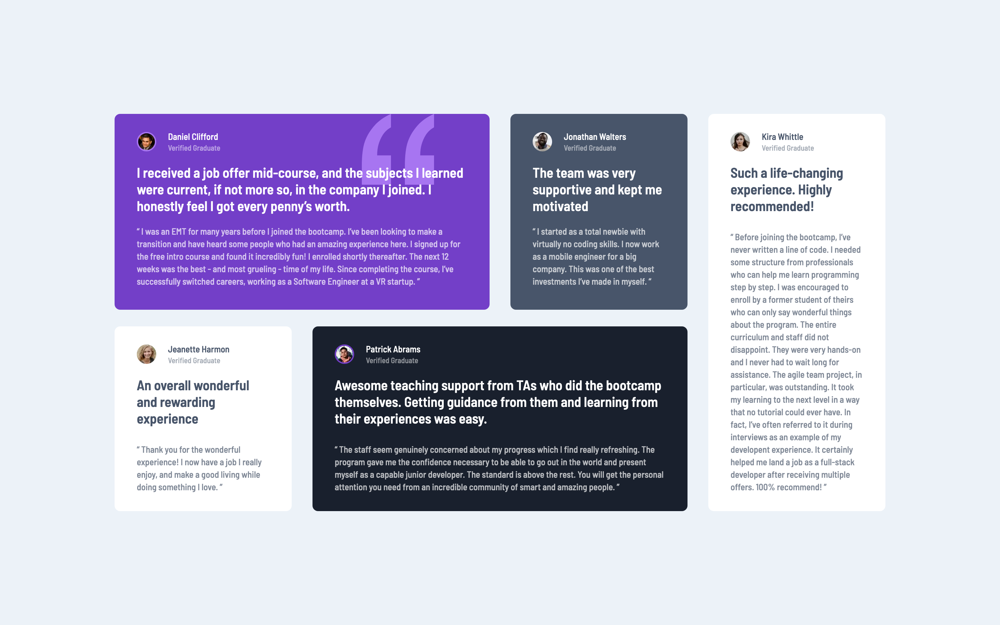
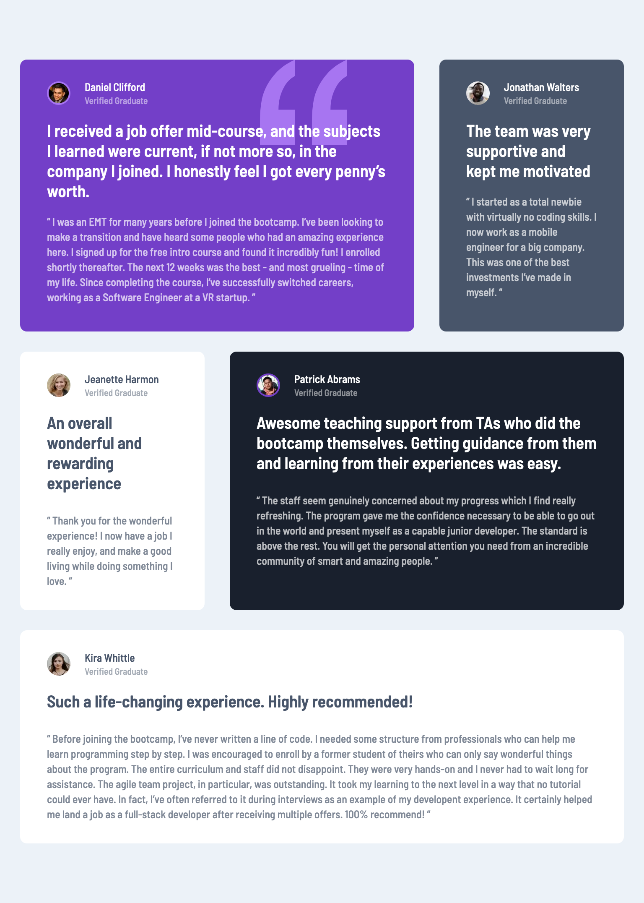
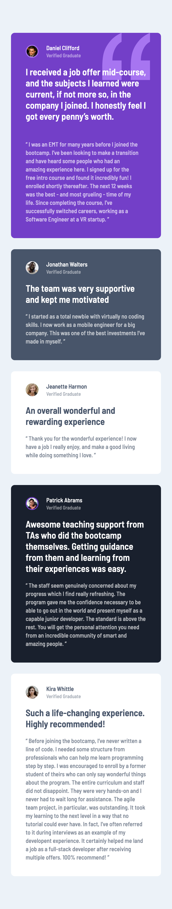

# Frontend Mentor - Testimonials grid section solution

This is a solution to the [Testimonials grid section challenge on Frontend Mentor](https://www.frontendmentor.io/challenges/testimonials-grid-section-Nnw6J7Un7). Frontend Mentor challenges help you improve your coding skills by building realistic projects.

## Table of contents

- [Overview](#overview)
  - [The challenge](#the-challenge)
  - [Screenshot](#screenshot)
  - [Links](#links)
- [Getting Started](#getting-started)
  - [Prerequisites](#prerequisites)
  - [Installation](#installation)
- [My process](#my-process)
  - [Built with](#built-with)
  - [What I learned](#what-i-learned)
  - [Continued development](#continued-development)
  - [Useful resources](#useful-resources)
- [Author](#author)

## Overview

### The challenge

Users should be able to:

- View the optimal layout for the site depending on their device's screen size

### Screenshot

<div style='display: flex; gap: 10px;'>



</div>

### Links

- Solution URL: https://www.frontendmentor.io/solutions/testimonials-grid-section-with-nextjs-tailwind-css-dUZdkqxdEI
- Live Site URL: https://testimonials-grid-section-zeta-eight.vercel.app

## Getting Started

To get a local copy up and running follow these simple steps:

### Prerequisites

Make sure you have the following software installed on your machine:

- [Node.js](https://nodejs.org/) (Node.js 18.17 or later)
- [pnpm](https://pnpm.io/)

### Installation

1. Clone the repository:

   ```sh
   git clone https://github.com/jaceleedev/testimonials-grid-section.git
   ```

2. Navigate to the project directory:

   ```sh
   cd testimonials-grid-section
   ```

3. Install dependencies using pnpm:

   ```sh
   pnpm install
   ```

4. Start the development server:

   ```sh
   pnpm dev
   ```

5. Open your browser and visit http://localhost:3000 to view the project.

## My process

### Built with

- Next.js (v14.2.5)
- TypeScript (v5)
- Tailwind CSS (v3.4.1)
- Semantic HTML5 markup
- CSS Grid, Flexbox
- SEO & web accessibility

### What I learned

Throughout this project, I gained valuable insights and improved my skills in several areas:

1. Handling the transition from desktop to mobile view was challenging. As the desktop layout was complex, I started with the desktop view first. I struggled with how to easily manage the responsive layout. The solution was to use the max-sm, max-lg, and similar classes provided by Tailwind CSS. These classes allow developers using a desktop-first approach to perfectly apply responsive design.

2. The code became increasingly difficult to read due to numerous conditional renderings. I was able to solve this using the clsx module. By handling complex logic with functions using clsx, the component became much cleaner.

3. Grid layout is truly powerful, but it takes more time to get familiar with compared to flexbox. I plan to continue using and practicing with grid to improve my skills.

These learnings have not only improved my technical skills but also given me a clearer direction for future growth and areas to focus on in upcoming projects.

### Continued development

In future projects, I want to continue focusing on and improving in these areas:

Tailwind CSS is an excellent library. However, to utilize it properly, I need to explore CSS in depth. I intend to continue putting in steady effort as I have been doing.

By focusing on these areas, I hope to continually improve my front-end development skills and create more efficient and sophisticated web applications.

### Useful resources

- [Next.js Documentation](https://nextjs.org/docs) - Comprehensive guide to Next.js features and API.
- [Tailwind CSS Documentation](https://tailwindcss.com/docs/installation) - Detailed documentation for Tailwind CSS.

## Author

- GitHub - [@jaceleedev](https://github.com/jaceleedev)
- Frontend Mentor - [@jaceleedev](https://www.frontendmentor.io/profile/jaceleedev)
